<div align="center">
  
</div>

<br>

---

<details>
<summary><b>🎮 MINIGAME</b> &nbsp;·&nbsp; Boot Sequence &nbsp;·&nbsp; <i>you've just SSH'd in. choose your path.</i></summary>

<br>

```
> SSH connection established.
> Welcome to marcello@github:~
> Three directories detected.
```

**`$ ls`**

```
/projects    /mind    /contact
```

---

<details>
<summary><code>$ cd /projects && ls -la</code></summary>

<br>

```
drwxr-xr-x  banking-platform/    [PRODUCTION]   enterprise full-stack system
drwxr-xr-x  data-science-msc/    [RUNNING]      neural nets · pipelines · math
drwxr-xr-x  stealth-build/       [CLASSIFIED]   something quiet. something sharp.
```

```
$ git log --oneline

* [2021 → now]  737+ contributions — uptime: 4 years
* [2025]        banking platform shipped to production
* [2025]        longest streak: 15 consecutive days
* [2024]        MSc Data Science — enrolled
* [2021]        init: first commit — Apr 20, 2021
```

> System status: `BUILDING` — process has never stopped since init.

</details>

---

<details>
<summary><code>$ cat /mind/philosophy.txt</code></summary>

<br>

```
I don't just write code.
I architect systems that hold up under pressure.
Design interfaces that don't need a manual.
Automate everything that shouldn't need a human.

The best software is the kind nobody notices
— because it just works.

Strategic thinking is not a buzzword.
It's chess. And I'm always three moves ahead.

Currently learning : how machines learn.
Currently building : something sharp.
Currently thinking : what comes next.
```

</details>

---

<details>
<summary><code>$ ping /contact --open-channels</code></summary>

<br>

```
PING marcello.mastroeni

→  linkedin.com/in/marcello-mastroeni   ........ [OPEN]
→  github.com/marcimastro98              ........ [OPEN]
→  collaborations                        ........ [LISTENING]
→  new ideas                             ........ [ALWAYS ON]
```

[](https://www.linkedin.com/in/marcello-mastroeni/)
[](https://github.com/marcimastro98)

</details>

---

```
$ logout

> Session terminated.
> See you on the other side of the terminal.
```

</details>

---

<div align="center">
  <sub><code>uptime: 2021 → ∞ &nbsp;·&nbsp; status: BUILDING &nbsp;·&nbsp; shutdown: never</code></sub>
</div>
